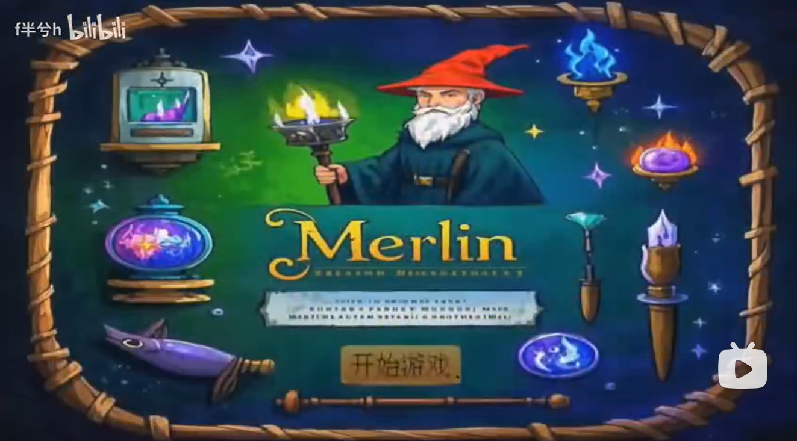
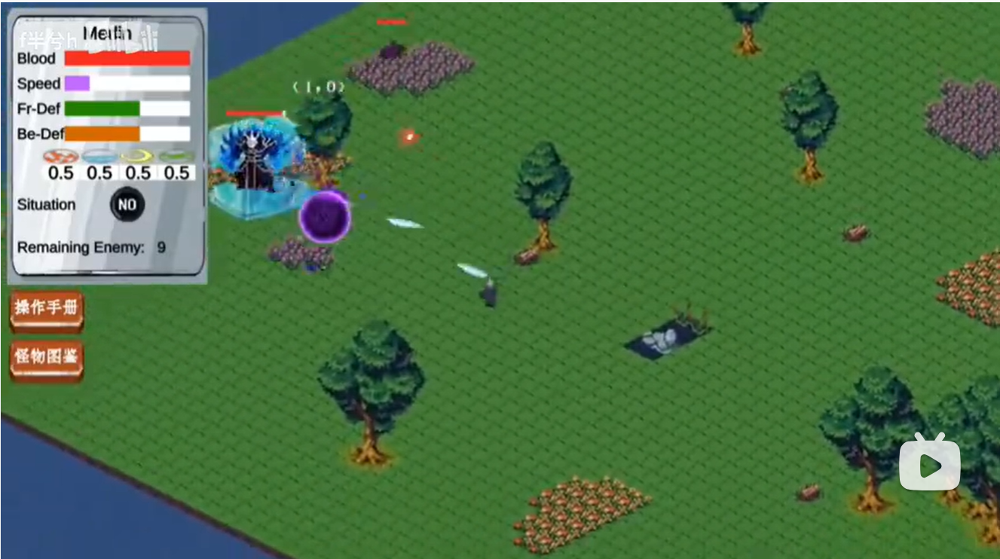
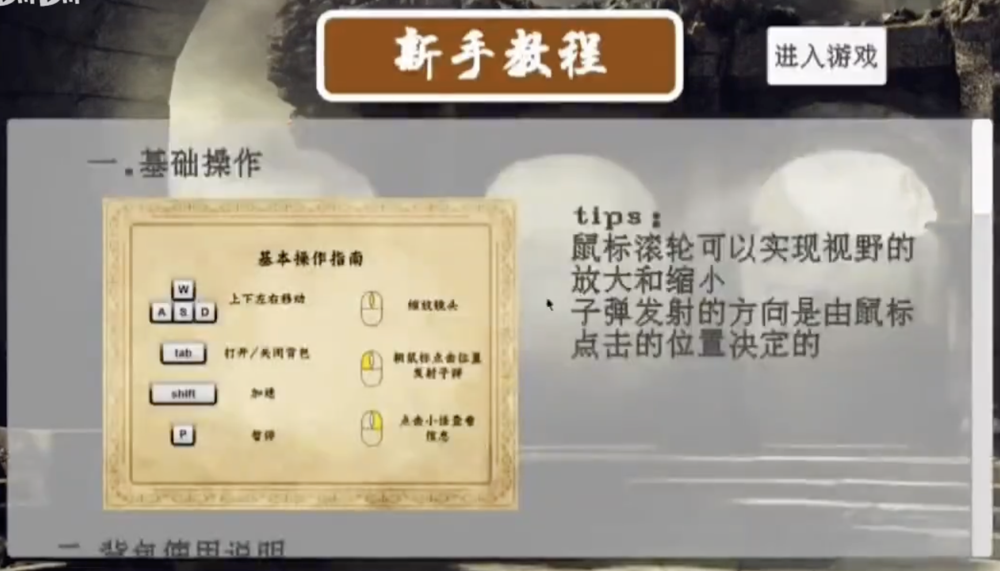

# 2D游戏开发介绍
<table style="margin: 0 auto;">
  <tr>
    <td>
      
      <figcaption style="margin-top: 8px; text-align: center;">精彩瞬间1</figcaption>
    </td>
    <td style="width: 30px;">
        &nbsp
    </td>
    <td>
      
      <figcaption style="margin-top: 8px; text-align: center;">精彩瞬间2</figcaption>
    </td>
  </tr>
</table>

---

## COMP561405 课程项目
### 基本信息
- 课程主页([点击这里](https://html5gameenginegroup.github.io/GTCS-Engine-Student-Projects/2025.3.XJTU/index.html))
- 西安交通大学，计算机试验班2301，2024-2025学年第二学期
- 仓库 *Merlin* 是本课程的期末项目，包含源代码和可游戏文件供下载

### 授课教师
- 🧑‍🏫 [宋贤清](https://faculty.washington.edu/ksung/)
- 🧑‍🏫 [唐亚哲](https://gr.xjtu.edu.cn/web/yztang)

---

## Merlin 游戏
- 成为你自己的魔法师 🧙
- 探索**多样**的魔法元素，🪄 创造**属于你**的法术
- 穿越**多样的魔法世界**，**击败**危险的敌人 🦹

### 如何游玩
- 从**release**下载游戏文件 `Merlin_v0.1.0_Windows.zip`
- 解压游戏文件并运行 `Merlin.exe` 开始你的冒险！（需要Windows操作系统）
- 我们在登录界面提供了详细的游戏说明👇

### 游戏精彩瞬间
[精彩瞬间集锦](https://www.bilibili.com/video/BV1i5QBYBEwg/?vd_source=b0d1dd10fcd3289aa9583d9cb680fb64)

### 关键技术

以下是本项目使用的主要技术的简要列举，详细说明请参阅 **[TECHNICAL_DESIGN.md](./TECHNICAL_DESIGN.md)**。

| # | 技术点 | 简述 |
|---|--------|------|
| 1 | **俯视角 Tilemap 地图风格** | 采用 Unity 双层 Tilemap，瓦片集覆盖草地/水体/雪地/沙漠等多种地形，配合 Cinemachine 实现平滑镜头缩放。 |
| 2 | **程序化地图与敌人生成** | 多倍频柏林噪声驱动四种气候地形的自动生成；敌人种类与数量随探索深度（曼哈顿距离）动态缩放。 |
| 3 | **存档与地图持久化** | 以世界坐标字典 `Dictionary<(x,y), SingleScene>` 持久化每张地图的种子与气候参数，二进制序列化写入本地；重访旧地图时直接还原，不重新生成。 |
| 4 | **模块化法术组件与子弹类继承设计** | `SpellEntity`（子弹实体）+ `SpellLogical`（行为修饰符）的可组合架构，任意数量修饰符可在运行时通过反射动态叠加，扩展新法术无需修改现有代码。 |
| 5 | **伤害判定与状态系统** | 每个实体持有五元素法抗数组；子弹命中时触发 `Hit()` 回调施加 10 种异常状态（灼烧、冰冻、中毒等），状态效果每帧计时更新。 |

### 我们的团队
💪 Merlin团队由西安交通大学的4名本科生组成，他们全力以赴创造属于我们的计算机魔法。

团队成员：
- 👨‍🎓 [李奕博](https://github.com/YiboLi-4110)
- 👨‍🎓 [刘添毅](https://github.com/Leotydk671)  
- 👨‍🎓 [张晟祺](https://github.com/bavarianvilliager)
- 👨‍🎓 杨子航